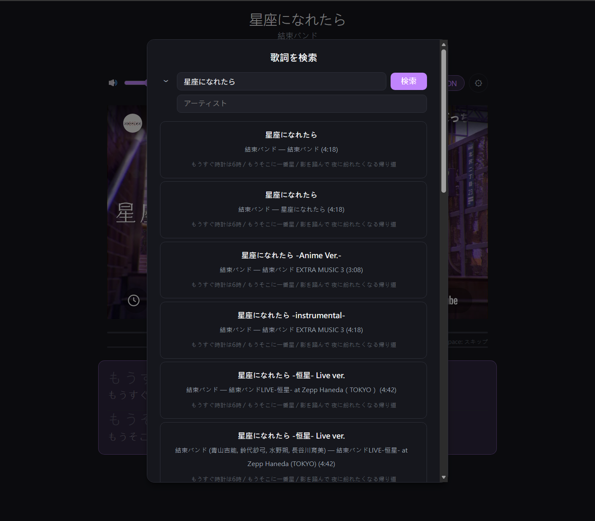

# Youtype 🎵⌨️

日本語の歌を YouTube で聴きながら、歌詞を打ち込んでタイピング練習できる Web アプリ。

## 概要

YouTube の楽曲動画に時刻同期された歌詞（+ ふりがな）を表示し、ローマ字でタイピングするゲームです。  
歌詞の1行を打ち終えるまで再生を一時停止する「練習モード」で、楽しみながら日本語入力を鍛えられます。

## スクリーンショット

| 開始画面 | タイピング中 | 歌詞検索 |
|:---:|:---:|:---:|
|  |  |  |

## 使い方

ブラウザで `youtype.srnns.com/watch?v=動画ID` にアクセスするだけ。  
YouTube の URL の `youtube.com` を `youtype.srnns.com` に置き換えれば、そのまま使えます。

### 操作方法

- **タイピング** — キーボードでローマ字を入力（入力ボックス不要）
- **スペース** — 歌詞の空白期間中に次の歌詞へスキップ / 打ち終えた後に次の歌詞へスキップ
- **⚙ 設定**（右上）— 練習モード ON/OFF、歌詞・ふりがなの文字サイズ調整、歌詞の手動変更
- **🔊 音量**（左上）— スライダーで調整
- 設定はブラウザに自動保存されます

## 機能

- 🎬 YouTube IFrame Player による動画再生
- 📝 時刻同期された歌詞表示（ふりがな付き）
- ⌨️ ローマ字タイピング入力（複数の入力パターンに対応）
- ✅ 正しく打った文字のリアルタイムハイライト
- ⏸️ 練習モード：歌詞を打ち終えるまで再生を自動停止
- 🔍 歌詞が見つからない場合の手動検索・選択
- 🎵 歌詞ソース：[LRCLIB](https://lrclib.net/)（優先）/ YouTube CC（フォールバック）
- 💾 歌詞キャッシュ（TTL + バージョン管理）

## 技術スタック

| レイヤー       | 技術                                      |
| -------------- | ----------------------------------------- |
| バックエンド   | Python 3.13 + FastAPI                     |
| パッケージ管理 | [uv](https://github.com/astral-sh/uv)     |
| フロントエンド | React + TypeScript (Vite)                 |
| 動画再生       | YouTube IFrame Player API                 |
| 歌詞取得       | `youtube-transcript-api` / LRCLIB API     |
| ふりがな生成   | `fugashi` + `unidic-lite`（バックエンド） |
| デプロイ       | Docker + GitHub Actions                   |

## セットアップ

### Docker（推奨）

```bash
git clone https://github.com/vaz1306011/YouType.git
cd YouType
docker compose up -d --build
```

`http://localhost:569` でアクセスできます。

### ローカル開発

#### 必要条件

- Python 3.13 + [uv](https://github.com/astral-sh/uv)
- Node.js

#### 起動

```bash
# 依存関係のインストール
uv sync
npm install

# バックエンド + フロントエンド同時起動
npm run dev
```

`http://localhost:5173/watch?v=動画ID` でアクセスできます。

## 歌詞の取得ロジック

1. **LRCLIB**（優先）— アーティスト名・曲名で検索し、タイムスタンプ付き `.lrc` を取得
2. **YouTube CC**（フォールバック）— 手動字幕（日本語 → 英語）→ 自動生成（日本語）の優先順で取得
3. **手動選択** — 上記で見つからない場合、曲名・アーティスト名を入力して LRCLIB から検索・選択

## タイピング判定について

`し` → `shi` / `si`、`っ` → 子音の重複 / `xtu` / `ltu`、`ん` → 文脈依存の `n` / `nn` など、複数の有効なローマ字表記を分岐状態機械で処理します。

## ライセンス

MIT
